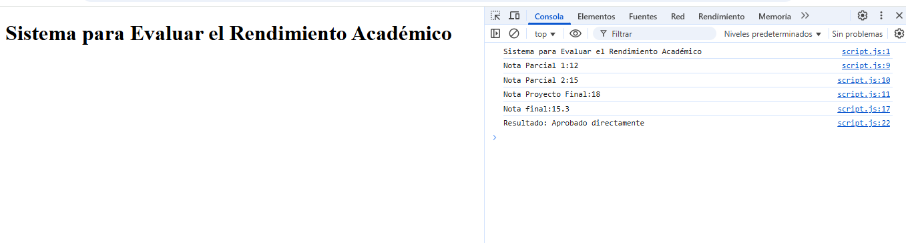

# tareaEvaluadorJS

## Repositorio correspondiente a la Tarea Evaluador JS

##### Tema:

Evaluador de Rendimiento Académico

#### Estudiante:

Steven Javier Díaz Lara

#### Tutor: Ing. Vilmer David Criollo Chanchicocha

#### Nrc:

23357

#### Objetivo:

Crear un programa en JavaScript que calcule la nota final de un estudiante sobre 20 puntos y determine si:

Aprueba directamente.
Debe ir a recuperación.
Pierde la materia.

##### Reglas:

Las tres notas se declaran directamente en el código:
parcial1 = 12;
parcial2 = 15;
proyectoFinal = 18;
Los pesos son:
Parcial 1: 30%
Parcial 2: 30%
Proyecto Final: 40%
Fórmula:
notaFinal = (parcial1 _ 0.3) + (parcial2 _ 0.3) + (proyectoFinal \* 0.4);

Evaluación:
Si la nota final es mayor o igual a 14: Aprobado directamente.
Si está entre 10 (inclusive) y 13.9: Va a recuperación.
Si es menor que 10: Pierde la materia.

#### Uso

Abrir el archivo **index.html**
Presionar F12 para ver la consola.
Se puede observar las notas ingresadas, la nota obtenida y el resultado respecto a si aprueba o no.

#### Deploy

